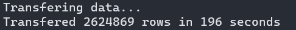
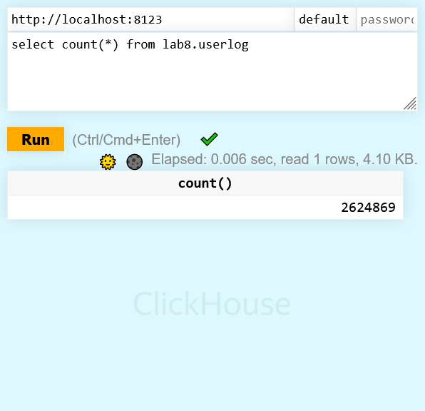

# Практика 8

## Перенос данных из Tarantool в Clickhouse
Для начала нужно создать базу данных и таблицу в ClickHouse

    ./create_clickhouse_table.sh

Переходим в директорию, где лежат файлы с данными спейса Tarantool

    cd ../lab7

Запускаем скрипт переноса

    tarantool ../lab8/transfer_data.lua

**Скрипт достает данные из tarantool циклом по индексу (с помощью `pairs()`), порциями по 10000 наборов, превращая их в CSV-строки.**

Результат:

Проверяем с помощью веб-интерфейса ClickHouse (http://localhost:8123/play):

Значения количества данных совпадают

## Выборка значений

    start=$( date +%s%3N )
    clickhouse-client --query="select * from lab8.userlog
            where day=1 and speed > 7190586.3267403
            or day=2 and speed > 7823114.2253453
            or day=3 and speed > 7627574.8502081
            or day=4 and speed > 7759980.1843792
            or day=5 and speed > 8013852.6257377
            or day=6 and speed > 8060999.8813053
            or day=7 and speed > 7476906.5154676" > select_values.txt
    duration=$(($( date +%s%3N ) - start ))
    echo "Select took ${duration} ms"

Результат:

    Select took 1628 ms
